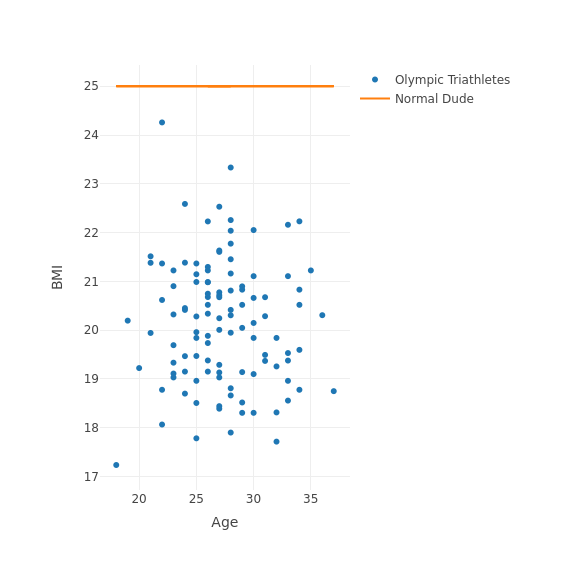

## About

- Learn more about the *2016 Olympic triathletes* with this app [here](https://wlvm.shinyapps.io/shinyRio/) and on [github](https://github.com/wlvm/ShinyRio)
- Have fun randomly rendering their home countries on a map
- Check if your *Body Mass Index* (BMI) is like that of a swim-bike-runner!

Upfront credit goes to: [Rio Olympics website](https://www.rio2016.com/) for data, logos and photo of the Brownlee brothers. 
Photo credits go to New York Times for title photo of my hero [Gwen Jorgenson](http://www.gwenjorgensen.com/).

---

## Triathlete country distribution (with plotly)

---

## Distribution of triathletes (Age and BMI)

--- 

## Scatterplot of normal person vs super triathlete

